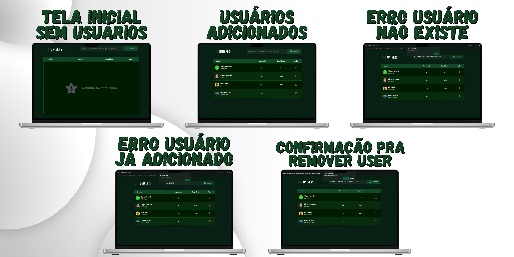

<h1 align="center"> Git Universe </h1>

https://github.com/almeida0808/GitUniverse/assets/144072612/da61a979-70fb-4c48-9da1-596ffe55a820

Site desenvolvido por Lucas Almeida

  <a href="#-tecnologias">Tecnologias</a>&nbsp;&nbsp;&nbsp;|&nbsp;&nbsp;&nbsp;
  <a href="#-projeto">Projeto</a>&nbsp;&nbsp;&nbsp;|&nbsp;&nbsp;&nbsp;
  <a href="#-layout">Layout</a>&nbsp;&nbsp;&nbsp;|&nbsp;&nbsp;&nbsp;
  <a href="#memo-licença">Licença</a>

  

 

## 🚀 Tecnologias

Esse projeto foi desenvolvido com as seguintes tecnologias:

- HTML e CSS
- JavaScript
- API de Dados do GitHub
- Git e Github
- Figma

## 💻 Projeto
O site Git Universo foi desenvolvido com intuito de me desafiar a criar um projeto com alguns sistemas feitos em JavaScript:
- Adicionar um usuario ,mostrando dados reais tirados do GitHub(Seguidores, Repositorios, Nome)
- Conferir se o usuário ja foi adicionado 
- Verificar se o usuário existe
- Quando não tiver nenhum usuário adicionado mostrar uma tela diferente
- Salvar as açoes dentro do LocalStorage(Banco de dados do navegador)
## 🔖 Layout 
O Layout original foi criado pela RocketSeat porém eu gosto de criar estilos unicos e que tragam uma boa experiência pros usuarios, decidi criar algo com tema de extraterrestre
a ideia tem como objetivo remeter ao universo do GitHub que contém milhares de usuários 

Você pode visualizar o layout original do projeto através [DESSE LINK](https://www.figma.com/file/YYdoXQIGEOtLWJuQwc1PYt/%5BDesafios-Explorer%5D-GitFav-(Copy)-(Copy)?node-id=206%3A1297&mode=dev) para acessá-lo.

## 🔖 Telas personalizadas

## Licença

Esse projeto está sob a licença MIT.

---

Feito por Lucas Almeida e Rocketseat :wave: - [Veja mais projetos no meu Linkedin](https://www.linkedin.com/in/almeida08/)
